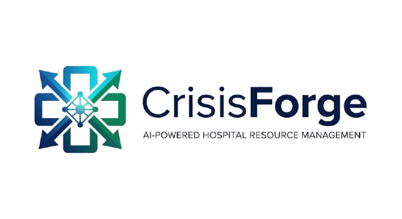

  

     
  

  <h1 style="font-family: 'Space Grotesk', sans-serif; font-size: 2.5rem; letter-spacing: -0.025em; color: #0f172a; margin-bottom: 8px;">CrisisForge AI</h1>
  
<strong>System Value Analysis & Operation Intelligence</strong>

  
Decoding the intelligence behind smarter crisis response.

---

## 📈 1. Predictive Intelligence: "Buying Local Time"

### What it does
The **Prediction Engine** forecasts the next 30 days of patient arrivals across the hospital network, accounting for active and emerging crises.

### How it works
It uses an **ARIMA-inspired time-series model** for base seasonality (weekly patterns) combined with **Monte Carlo simulations** to generate 200 possible "futures." This produces confidence intervals (P10–P90) rather than a single point prediction.

### Importance
In a crisis, the difference between "reacting" and "anticipating" is measured in hours. By forecasting resource burnout before it happens, the system allows administrators to shift staff and supplies 24–48 hours **before** wait times become critical.

### Meaning
- **Green Zone (P25-P75):** Normal operational variance.
- **Red Zone (P90):** Worst-case surge scenario; requires immediate resource activation.

---

## ⚖️ 2. Allocation Strategy Lab: "Ethical Trade-offs"

### What it does
Allows operators to simulate the impact of different resource distribution policies (FCFS, Severity, Equity, Optimized) on patient outcomes.

### How it works
A **Discrete-Event Simulation** engine runs the projected patient inflow against fixed hospital capacities (Beds, ICU, Vents). It tracks "lives saved" vs. "denied care" based on the chosen strategy's priority logic.

### Importance
Resource allocation is a moral and systemic challenge. CrisisForge provides data-backed evidence for which policy is most effective for the *current* crisis type (e.g., Equity-Weighted for long-term pandemics vs. Severity-Based for earthquake spikes).

### Meaning
- **Mortality Estimate:** The projected human cost of the current policy.
- **Resource Utilization:** Measures system efficiency to prevent idling equipment while patients wait.

---

## 🚑 3. Transfer Hub: "Network Load Balancing"

### What it does
Recommends intelligent patient transfers between hospitals to prevent any single facility from collapsing under a "saturation surge."

### How it works
It calculates a **Composite Pressure Score** (weighted index of Bed, ICU, Vent, and Staff availability). When a sender hospital crosses a 75% threshold, the engine identifies the mathematically "closest" receiver hospital with the most surplus capacity, factoring in distance-to-care time.

### Importance
Without centralized intelligence, hospitals often collapse while a facility 10km away has empty beds. This engine turns isolated hospitals into a **unified resilient network**, increasing overall system capacity without adding single a new bed.

### Meaning
- **Pressure Gain/Loss:** The % decrease in stress for the sender vs. the % increase for the receiver.

---

## 🧠 4. ML AI Predictor: "Precision Triage"

### What it does
Predicts the clinical outcome (Discharged, Admitted, Critical, Deceased) of an individual patient based on their physiological and context data.

### How it works
Uses a **Gradient Boosting Model** trained on 5,000 clinic records. It processes 15 features including SpO2, Heart Rate, and comorbidities. It includes **SHAP Feature Perturbation** to explain the *why*—showing which vitals contributed most to a high-risk prediction.

### Importance
During high-volume surges, human triage error increases. The AI Predictor serves as a "second clinical opinion," flagging high-risk patients who might otherwise be overlooked, ensuring ICU resources go to those with the highest clinical need.

### Meaning
- **Risk Level:** Immediate tactical instruction (High Risk = Priority ICU pathway).

---

## ⚕️ 5. FairFlow Engine: "Systemic Equity Audit"

### What it does
Actively monitors the healthcare network for **structural bias**, specifically ensuring that rural and marginalized communities are not deprioritized for transfers or admissions.

### How it works
Computes a **Fairness Ratio** comparing wait times and transfer success rates for Rural vs. Urban origins. It enforces **Hard Ethical Constraints** (e.g., blocking a transfer that would exceed a patient's safe travel limit or violates origin-priority rules).

### Importance
In many health systems, "rural disadvantages" are invisible until after the crisis. FairFlow makes equity a **real-time metric**, forcing the system to re-balance resources before disparities become a systemic failure of care.

### Meaning
- **Fairness Score (0.0 - 1.0):** 1.0 indicates perfect systemic equity. Drops below 0.6 indicate a "Bias Alert" requiring administrative review.

---

## 📱 6. Telegram Command Alerts: "Frictionless Response"

### What it does
Instantly broadcasts critical capacity alerts and transfer commands to the entire hospital operator network.

### How it works
Integrates the backend intelligence with the **Telegram Bot API**. It autonomously monitors for threshold breaches (e.g., "AIIMS Nagpur ICU at 98%") and formats a command-ready message for regional leaders.

### Importance
Email or dashboards aren't always seen in a frantic trauma ward. Telegram bypasses the "UI barrier," putting actionable intelligence directly into the pockets of decision-makers where they already communicate.

### Meaning
- **Live Broadcast:** Turns system intelligence into physical action in seconds.

---

*CrisisForge AI — Empowering Clinical Resilience through Data Science.*
